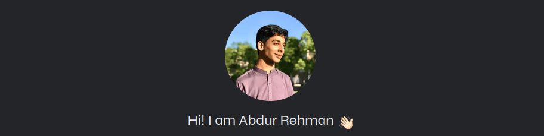

# 🚀 Abdur Rehman — Portfolio Website

<div align="center">

# 👋 Personal Portfolio

A modern, responsive, and performance-focused developer portfolio built with **Next.js 16**, **React 19**, **TypeScript**, and **Tailwind CSS v4**.

Designed to showcase my projects, technical skills, and backend development journey while following modern web development best practices.



---


</div>

---

# 📖 About

This repository contains the source code for my personal portfolio website.

The portfolio represents my journey as a **Backend Developer (Learning)** and highlights the technologies, projects, and backend engineering concepts I have been exploring throughout my Software Engineering degree.

The project focuses on clean architecture, responsiveness, accessibility, performance optimization, and SEO while keeping the codebase maintainable and lightweight.

---

# 👨‍💻 About Me

**Name:** Abdur Rehman

**Role:** Backend Developer (Learning)

**University:** Superior University

**Program:** BS Software Engineering (7th Semester)

I'm passionate about building modern web applications using TypeScript and JavaScript technologies while continuously improving my frontend and backend development skills.

---

# ✨ Features

## 📌 Sticky Navigation

- Responsive sticky header
- Mobile slide-out navigation
- Smooth scrolling navigation

## 👋 Hero Section

- Professional introduction
- Profile image
- Resume download button
- Email CTA button

## 🙋 About Section

Information cards including:

- Languages & Frameworks
- Education
- Projects
- Tools I Use

## ⚙️ Services

Backend-focused service cards:

- REST API Development
- Database Design
- Authentication & Security
- Backend Architecture

## 🚀 Projects

Featured portfolio projects:

- CyberSecure
- HunarGah
- VisionHome AI

Each project includes quick access links for further exploration.

## 📬 Contact

- Contact form powered by **Web3Forms**
- Social media links
- Email integration

## 📱 Fully Responsive

Optimized for:

- Desktop
- Laptop
- Tablet
- Mobile

---

# 🛠 Tech Stack

## Frontend

- Next.js 16 (App Router)
- React 19
- TypeScript 5

## Styling

- Tailwind CSS v4

## Fonts

- Google Fonts (Syne)
- Optimized using `next/font`

## Forms

- Web3Forms

## Deployment

- Vercel

---

# ⚡ Performance Optimizations

Performance was one of the primary goals while building this portfolio.

### ✅ Optimizations Included

- Lazy loading using `next/dynamic`
- Optimized images using `next/image`
- Self-hosted fonts via `next/font`
- All images converted to **WebP**
- Minimal production dependencies (only **3** packages)
- Automatic code splitting
- Optimized asset loading
- Responsive image rendering

---

# 🔍 SEO Improvements

The portfolio follows modern SEO best practices.

### Included

- Semantic HTML
- Proper heading hierarchy
- Descriptive alt text
- Metadata configuration
- Server-Side Rendering (SSR)
- Search engine friendly structure

---

# ♿ Accessibility

Accessibility was considered throughout the development process.

Features include:

- Semantic page structure
- Keyboard-friendly navigation
- Meaningful HTML elements
- Image alt text
- Support for `prefers-reduced-motion`

---

# 🖼 Assets & Resources

Icons and graphical assets were sourced from:

- **thesvg.org**
- **flaticon.com**

Image optimization:

- Converted to **WebP**
- Optimized using **Squoosh.app**

---

# 📂 Project Structure

```text
portfolio/
│
├── public/
│   ├── images/
│   └── resume/
│
│   ├── app/
│   │   ├── layout.tsx
│   │   ├── page.tsx
│   │   └── globals.css
│   │
│   ├── components/
│   │   ├── Header/
│   │   ├── Hero/
│   │   ├── About/
│   │   ├── Services/
│   │   ├── Projects/
│   │   ├── Contact/
│   │   └── Footer/
│   │
│   ├── assets/
│   ├── lib/
│
├── package.json
├── next.config.ts
└── README.md
```

---

# 🚀 Getting Started

## Clone Repository

```bash
git clone https://github.com/AbdurRehman1299/abdurrehman_portfolio-.git
```

## Navigate

```bash
cd abdurrehman_portfolio-
```

## Install Dependencies

```bash
npm install
```

## Run Development Server

```bash
npm run dev
```

Open:

```
http://localhost:3000
```

## Build for Production

```bash
npm run build
```

## Start Production Server

```bash
npm start
```

---

# 🌐 Deployment

This project is deployed using **Vercel**.

The deployment benefits include:

- Automatic GitHub deployments
- Global CDN
- Server-side rendering support
- Fast build pipeline
- Edge optimization

---

# 📊 Project Highlights

✅ Built using the latest **Next.js 16 App Router**

✅ Fully typed with **TypeScript**

✅ Responsive across all devices

✅ Performance optimized

✅ SEO friendly

✅ Accessibility focused

✅ Modern UI animations

✅ Lightweight architecture

✅ Production-ready deployment

---

# 📫 Connect With Me

### GitHub

https://github.com/AbdurRehman1299

### LinkedIn

https://linkedin.com/in/abdur-rehman313

### Twitter / X

https://x.com/abdur_rehmandev

### Email

abdurrehman76001@gmail.com

---

# 🤝 Contributing

Contributions, ideas, and feedback are always welcome.

Feel free to fork the repository, open issues, or submit pull requests.

---

# 📄 License

This project is licensed under the **MIT License**.

Feel free to use the code for learning and inspiration.

---

<div align="center">

### ⭐ If you found this project helpful, consider giving it a star!

Made with ❤️ using **Next.js**, **TypeScript**, and **Tailwind CSS**

</div>